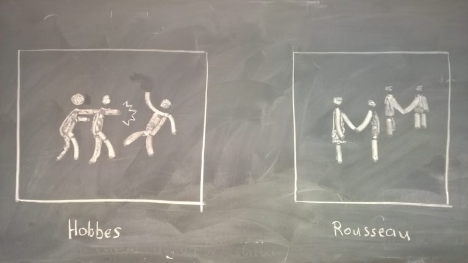

# Antropologio – Naturo de la homo; kiu ĝi estas?

La esenco de homoj - la natura stato de homoj - ne estas certe konata. Sed filozofoj pensis pri tio. Ili pensis kiel prahomoj kaj homoj sen asocioj agis kaj kial. Sekvas nun mallongaj resumoj de opinioj de du filozofoj: Thomas Hobbes (\*1588, †1679) kaj Jean-Jacques Rousseau (\*1712, †1778). [^1]

# Opinio de Hobbes

Pro malpaco kaj civita milito en Britio dum la 17-a jarcento, filozofo nomiĝas Hobbes ekpensis pri la homa esenco. Li imagis kiel homoj agus, se asocioj aŭ registaroj ne ekzistus. Tiu esencstato estus, laŭ lia opinion, ne pace sed tute malice kaj egoisme. Tiu opinio tute kontraŭas aliajn opiniojn, kiuj ofte klarigas, ke la homoj estus prudente kaj bone; sen asocioj:

Hobbes unue klarigas, ke ĉiu homo samas la alian. Ja ekzistas distingoj, kiuj ekzemple rilatas al la fizika forto, sed malgraŭ tio du pli malfortaj homoj privenkus fortan homon. Kaj malfortulo ankaŭ povus uzi kaptilon aŭ ruzon por privenki. Kaj ĉi tio principo ĉiam ekzistas. Sekve, homoj kutime similas je la forteco; kape aŭ fizike.

Sed pro tio simileco, la homoj sekvas samajn celojn: vivi. Kaj tial ĉiu sekvas la samajn rimedojn. Ĉiu bezonas manĝaĵon kaj akvon. La problemo nun estas, ke tiaj rimedoj ne senfine ekzistas. Kaj la manko de rimedoj kondukas maliculojn.

Dum tio situacio, ambaŭ kontraŭuloj provos aligi malbonon, por ke la alia ne atingas _la proprajn_ aĵojn. La rezulto estas konstanta suspekto kaj antaŭzorga potenco. Do laŭ Hobbes, la homoj atakus unu la alian por ne esti atakota mem. Sekvas eterna suspekto kaj senfina milito.

# Opinio de Rousseau

Rousseau, alia filozofo, ankaŭ pensis pri la naturo de la homoj. Liaj pensoj bazas sur vojaĝraportoj (pri pralandanoj el Ameriko) kaj rezultas je idealskemo de la _nobla sovaĝulo_. Li tute kontraŭas la opinion de Hobbes, ĉar li opinias, ke homoj estas bonaj kun empatio. Estas grava mencii, ke Rousseau pensis pri la sola homo - sen aŭ antaŭ asocioj - kaj ne pri homoj, kiu pliobliĝis.

Laŭ Rousseau, la esenco de homoj bonas kaj li deduktas tion de bestoj, ĉar la prahomoj observis kaj imitis bestojn. Sole pro la ebleco por paroli, racio kaj memkonscio, la homo malsamas al bestoj. Kaj la homoj estas egale - simila al la opinio de Hobbes.

Kutime, la prahomoj vivis sole kaj nur zorgis pri si mem. Ili havis tri bazajn trajtojn: Sinamo, kompato kaj perfekteco.

Sinamo, orginita de racio, konsistigas homojn, ĉar la prahomo nur pensis pri transvivo kaj pro tio, ili nur pensis pri si; do sin mem amis. Sed malgraŭ tio, Rousseau ne pensas, ke homoj estas egoismuloj. La ebleco senti kompaton, ankaŭ konsistigas homojn kaj estas natura kontraŭeco por moderigi la sinamon. Perfekteco estas la kompleteco de la homoj. Ili ne bezonis pli por ke ili estis feliĉaj kaj havi belajn vivojn. Pro tio, ili estis liberaj por fari iun ajn, kiun ili ŝatis.

Fine, la homoj ja kuniĝis, pro diversaj kialoj. Ekzemple popolkreskiĝo, malkreskiĝo de spaco, manko de nutraĵoj aŭ naturkatastrofoj. Sed tiam, ekokazas malekvilibro pro propraĵoj kaj la homoj forlasas la naturan staton.

# Kies estas ĝusta?

Resume: ĉu natura esenco ekzistas estas alia demando, sed filozofoj ne konsentas pri ĝia maniero. Hobbes estas maloptimisto. Frazoj kiel “Homo homini lupus.” (La homo estas lupo kontraŭ homoj.) aŭ “Bellum omnium contra omnes.” (Milito, ĉiu kontraŭ ĉiu.) bone montras lian opinion. Alia maniere, Rousseau pensis pri pli pacaj homoj kun kompato kaj precipe pri feliĉaj prahomoj.

[^2]

Kies opinio nun veras, aŭ ĉu eĉ unu el ili estas vera, mi ne scias, sed malgraŭ tio estas interesa pensi pri tio, kaj kiel oni agus sen asocioj, aŭ kiel homoj agis antaŭ mil da jaroj.

[^1]: La ĉefaj fontoj de ĉi tiu artikolo devenas la lernejtempon. Do mi ne plu scias la ekzaktan fonton, krom ke estis lernejlibro nia. Ni kune, kiel klaso, rezumis diversajn temojn el ĝi, kaj jen estas rezumo de unu temo.

[^2]: Fonto de la bildo estas [ĉi tie](https://blogs.fu-berlin.de/menschenbilder/2017/12/03/der-mensch-ist-von-natur-aus-gut-ich-glaube-es-nachgewiesen-zu-haben-rousseau-1755/).
