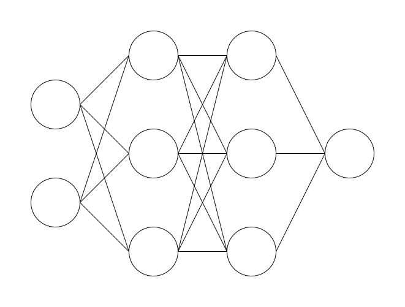
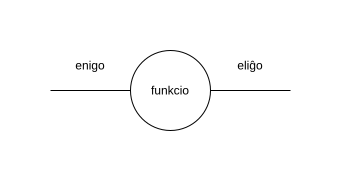
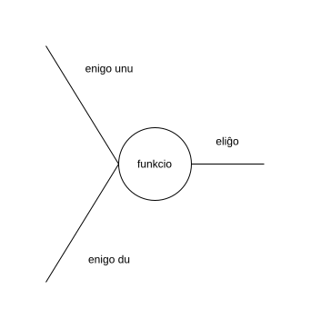
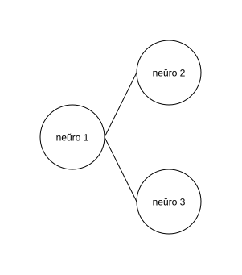
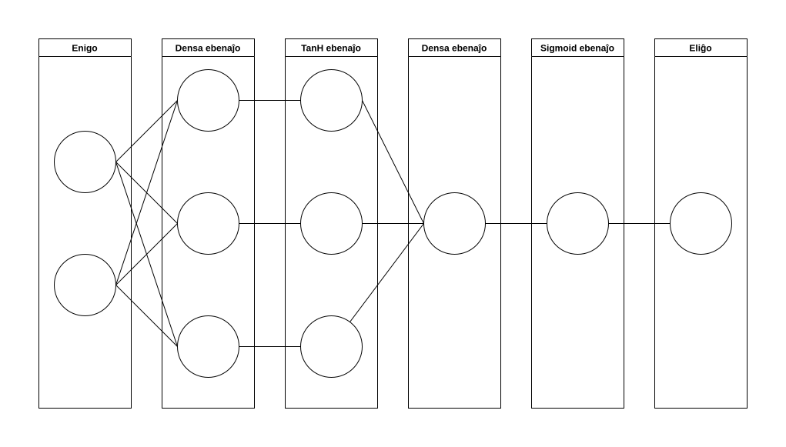

# Neŭraj retoj - kial ili malpravas

En la hodiaŭa tempo, multaj homoj uzas AIon. AI fariĝis eble tag-al-taga akompananto de iom da homoj. Fariĝis tiel, ke multaj homoj uzas ĝin kaj ekfidas ĝin. Tamen ĉiam ankaŭ restas la onidiraĵo, ke oni ne sengarde fidu je AI. Ĉu homoj tion vere faras aŭ ne estas alia demando. Tamen, almenaŭ laŭ mia opinio, estas inda kompreni kaj lerni iom pli pri AI. 

Ĉiam, kiam mi kaj / aŭ miaj kolegoj uzas AIon, mi ĉiam memorigas min, ke temas pri matematiko. AI estas - ne plu tiom - simpla statistiko. Tamen, ŝajnas al mi persone, ke homoj ofte forgesas tion fakton.

Matematiko havas regulojn. Ĝi estas sistemo regula. Kaj se oni komprenas la regulojn, oni ankaŭ povas kompreni, kial neŭraj retoj kaj aliaj tipoj de AI povas fuŝi.

Tiu ĉi artikolo havas la celon iom klarigi pri facilaj neŭraj retoj je teoria kaj poste eĉ praktika flanko. Simple pli bone eblas kritike rigardi kaj juĝi, kiam oni komprenas, kiel ili funkcias, kaj kial ili malpravas. Ĝi komencas la klarigadon kun bazaj konceptoj de matematiko, aplikas ilin kaj evoluas la teoriajn konceptojn tiajn al teorio pri neŭraj retoj; unue rigardonte la strukturon mem, poste uzante praktikan ekzemplon kiel neŭra reto _konjektas_, kaj laste kiel ĝi lernas.

> **ATENTU**: Mi nek estas fakulo pri neŭraj retoj nek matematiko. Do, la sekvantaj klarigoj povas enhavi erarojn, ĉu enhavajn aŭ formalajn. Aldone, necesas diri, kvankam ĝi pli detale enkondukas en la temon, ĝi restas je la surfaco de neŭraj retoj kaj faciligas [ĉefe] la matematikon, por ke tiu teksto ne fariĝas tro malfacile komprenebla kaj longa.

# Ĉefa koncepto

En la koro, la matematiko, kiu estas baze por neŭraj retoj ne estas tro komplika. Krei kvazaŭ fundamenton, kiu uzeblas poste kaj fariĝos bezonata estas celo de ĉi tiu ĉapitro.

## Funkcioj

Imagu vi havas ian procezon, ian kalkulmanieron, kiu donas respondon al vi pri jena demando: Kiom da mono mi havas, se mi duobligus monon mian nunan? Kiu estus tiu kalkulmaniero? Ĉu vi povus klarigi, kiel vi kapablus kalkuli tion? Estas sufiĉe facila demando, ĉu? Duobligado de iu numero ne estas tiom malfacila:

$$
\text{duobligata mono} = \text{nuna mono} * 2
$$

Ni simple multiplikas nian nunan monsumon kun du.

Tio estas la kerna ideo de neŭraj retoj, kaj fakte de AI entute. Kion ni havas ĉi tie estas tri aferoj:

1. Ni havas **enigon**. Ni havas ion, kion ni enmentas, kion ni bezonas. Ion, kio necesas por respondi la demandon.
2. **Eliĝon** havas ni. Tio estas kvazaŭ la malo de la enigo. Ĝi estas la respondo, kiun ni volas havi.
3. Ni havas ian **funkcion**, ian operacion, ian procezon, kiun ni bezonas, por ricevi nian respondon.

En la supra ekzemplo, ni havas nian nunan monon kiel enigo, nia havas la duobligitan monon kiel eliĝo, kaj ni havas la _multipliki kun du_ parto, kiu estas nia funkcio.

Tion, ni ankaŭ povas skribi tiel:

$$
\text{duobligita\_mono}(\text{nuna\_mono}) = \text{nuna\_mono} * 2
$$

Ni havas la eliĝon je la maldekstra flanko. Ĉirkaŭata de parantezoj, ni havas nian enigon. Kaj je la dekstra flanko de la egalecsimbolo, ni havas nian funkcion.

Tiun koncepton, de funkcioj, oni povas grandigi. Verŝajne tiu procezo jam estas konata aŭ iomete memorata el la lernejo. Por doni ekzemplon, tiu funkcio eligas la kvanton da mono, kiun ni havus post iom da jaroj, se ni ĉiujare ekŝparas iun kvanton:

$$
\text{mono\_post\_jaroj}(\text{jaroj}, \text{ĉiujara\_ŝparmono}) = \text{jaroj} * \text{ĉiujara\_ŝparmono}
$$

Tio verŝajne ankaŭ estas sufice facile. Ni simple multipliku la jarojn kaj la sumon de la mono, kiun ni volas ŝpari.

Por ke ĝi aspektu iom pli mallonga, ni povas diri, ke nian finan sumon ni nomu "m", la jarojn, kiujn ni atendas, nomu ni "j", kaj la ŝparmono ĉiujara estos "ŝ". Tiel, la priskribo de la funkcio pli mallongiĝas:

$$
m(j, ŝ) = j * ŝ
$$

Tiu estas la baza koncepto, kiun ni bezonas por kompreni, kiel simpla neŭra reto funkcias.

## Kreado de funkcioj

Ĝis nun, ni havis simplajn ekzemplojn, kiujn ni sufiĉe bone kapablis kompreni. Duobligo de kvanto da mono ne estas tro taksa demando. Tamen, ni ja volas uzi AI-on por pli komplikaj aferoj: ekzemple, ni volas, ke la reto kalkulu ĉu vorto estas en la akuzativo, aŭ ne. Antaŭe, ni lernis pri la tri ĉefaj eroj de funkcioj. Ni simple trarigardu tiujn kaj kreu ilin por tiu ĉi kazo:

### Enigoj

Ni kiel homoj, kion ni bezonas, por ke ni kapablas decidi, ĉu vorto estas en sia akuzativa formo? Nun, ni simple rigardas al la fino de la vorto:

| Vorto  | Ĉu estas en akuzativformo? |
| ------ | :------------------------: |
| Homoj  |             ne             |
| dancas |             ne             |
| la     |             ne             |
| bambon |            jes             |

Ni scias, kiam vorto finiĝas per _n_, ĝi estas en sia akuzativformo. Sed, ĉu tio ĉiam veras? Ni rigardu la vorton _en_. _En_ ne estas en akuzativformo. Sed tamen ĝi finiĝas per _n_. Hoo, kion ni faru do? Ni bezonas alian informon, por decidi, ĉu vorto estas en sia akuzativformo. Eble ni povas simple havi alian enigon. Ne nur la informon, ĉu la vorto finiĝas per _n_, sed ankaŭ ĉu la vorto estas _en_.

Oni do povas diri, ke ni havas du enigojn:

1. Ĉu la vorto finiĝas per _n_?
2. Ĉu la vorto estas _en_?

Bonŝance, ambaŭ estas _ĉu_-demandoj, do simple povas kodigi la respondon per unu kaj nulo. Unu, kiam ni respondus *jes*, kaj nulo, kiam ni respondus *ne*. Do por la vorto _homon_ kiel ekzemplo: $(1, 0)$. La unu, ĉar ĝi finiĝas per _n_, kaj la nulo, ĉar ĝi ne estas la vorto _en_. Por _homo_, la enigoj estus $(1, 0)$, kaj por la vorto _en_ ili estus $(1, 1)$.

(Mi scias, ke ankaŭ aliaj vortoj en EO povas finiĝi per _n_ - pli da informoj poste. Nun ni uzu tiun elirpunkton por faciligi la aferon.)

### Eliĝo

Ni simple volas havi funkcion, kiu respondas jesante aŭ neante. Kion ni povas fari estas preni la respondon de nia funkcio - simile al kion ni faris antaŭe kun niaj enigoj - kaj interpreti ĝin tiel: se nia funkcio eligas nulon, tio signifas _ne_, kaj unu signifas _jes_; en aliaj vortoj, se la rezulto estas pli granda ol 0.5, ĝi signifas _jes_. Alikaze, ĝi signifas _ne_.

Tiel, ni jam konstruis la preskaŭ plej gravajn partoj de nia neŭra reto:

$$
\text{ĉu\_estas\_en\_akuzativ\_formo}(\text{ĉu\_finiĝas\_per\_n},\text{ ĉu\_estas\_la\_vorto\_en})
$$

Ni havas niajn eligojn, kaj ankaŭ nian volantan rezulton. Ni mallongigu tion denove al ĉi tiu:

$$
a(n, en)
$$

### Funkcio

Kio ankoraŭ mankas estas la funkcio, la procezo kiu kalkulas, mem:

$$
a(n, en) = (1+e^{-(tanh(n * 2.283674665067458 + en * (-2.1665145014638165) - 1.094394367981149) * 4.145756420249966 + tanh(n * 0.4899436761197884 + en * 0.8746020521312748 + 0.6963367464773846) * (-0.042714285958402584) + tanh(n * 1.5077663199380498 + en * (-0.8981286566027182) - 0.7369102375662379) * 2.150114119345494 - 0.48140499271027837)})^{-1}
$$

Facilege, ĉu? Koran dankon por legi, kaj ĝis la - eta ŝerco. Kvankam ĝi aspektas treege hazarda, tio ĉi estas solvo por nia problemo. Jen la supraj ekezemplaj vortoj:

| Vorto | enigoj  |        Eliĝaĵo        | Ĉu estas en akuzativformo? |
| ----- | :-----: | :-------------------: | :------------------------: |
| homo  | $(0,0)$ | $0.00567427715081225$ |             ne             |
| homon | $(1,0)$ | $0.9868443432414942$  |            jes             |
| en    | $(1,1)$ | $0.01960843174569401$ |             ne             |

Sed kiel kreis mi tiun ĉi funkcion? Kial mi scias, ke temas pri $1.5077663199380498$, kaj ne pri $42$ aŭ io alia?

# Teorio de neŭraj retoj

Nun, ni alvenis ĉe neŭraj retoj. La respondo, al la fina demando de la antaŭa ĉapitro estas tio ĉi: neŭra reto.

Por ricevi tiun funkcion, tiujn numerojn, kiujn oni kalkulu, mi kreis kaj trajnis neŭran reton. Post trajnado, mi simple enrigardis la reton, kaj notis la enhavon tiel, ke ni povas vidi kion ĝi kalkulas. Ne vere gravas kompreni ĉiun paŝon de la kalkulado nun. Sed supran koncepton ni tuj vidos.

## Neŭra reto kiel funkcio

Vi verŝajne jam vidis bildon de neŭra reto kun siaj strekoj, cirkloj. Sed ĉu vi ankaŭ scias, kion vi vidas sur tiaj bildoj? Ni uzu tiun ĉi bildon kiel ekzemplo:

Sur ĝi vi povas vidi multajn strekojn, kaj ok cirklojn. Ĉiu cirklo estas neŭro, kaj kune - indikate per la strekoj - ili fariĝas reton.

Ĉiu vertikalo, al kiu apartenas en la bildo aŭ du aŭ tri neŭroj, estas nomata _ebeno_.

## Ebenoj

Ĉiu ebeno kaj neŭro estas funkciero. Por ni gravas la ebenoj, ĉar pli facilas rigardi neŭron kiel aro en ebeno pro la fakto, ke neŭroj en unu ebeno estas de la sama tipo.

### Densaj ebenoj

Por pli bone kompreni, kiel ebeno estas funkciero, ni unue lernu, kio estas densaj ebenoj.

Por tio, ni unue rigardu unu neŭron. Ĉiu neŭro estas similia al la koncepto, kiun ni antaŭe jam ekkonatiĝis. Ĉiu neŭro havas minimume unu enigon, kaj eliĝon, kiun ĝi eligas per ia funkcio. La funkcio dependas de la ebeno al kiu la neŭro arpatenas. Unu el la plej gravaj ebenoj - eble la plej grava - estas la densa ebeno. 

La densa ebeno enhavas la jenan funkcion:

$$
f(e) = e * g + b
$$

$f$ estas funkcio nia, do la eliĝo, kaj $x$ estas nia enigo. Sed kio estas $g$, kaj kio estas $b$?

- $g$ estas la _graveco_. Graveco, ĉar ĝi indikas, kiom grava la enigo estas por kalkuli la rezulton. Ju pli grava $x$ por la ĝusteco de la rezulto, des pli alta $g$.
- $b$ estas la _biaso_. La biaso influas la rezulton, ne rigardante la gravecon.

Por ni, la nun grava afero estas, ke ĉiu neŭro en densa ebeno enhavas du numerojn: $g$ kaj $b$. Se tiu du nombroj samas, la neŭro ĉiam eldonas la saman rezulton. Ŝanĝoj al la $g$ kaj $b$ rezultas - kompreneble - en aliaj rezultoj.

Uzante $g=2$ kaj $b=0$, kiel ekzemplo, ni ricevas la funkcion, kiun ni antaŭe uzis por kalkuli la duoblon de iu numero:

$$
\text{duobligata mono}(\text{nuna mono}): f(x)=x*2+0
$$

Kiel mi diris antaŭe, neŭro ĉiam minimume havas unu enigon. Kompreneble, ĝi ankaŭ povas havi plurajn:

Tiam, nia funkcio en la neŭro aspektas tiel:

$$
f(e_1, e_2) = e_1 * g_1 + e_2 * g_2 + b
$$

Ni nun povas vidi, ke ni havas du enigojn, kaj ĉiu havas gravecon. Tamen, la biaso restas je unu po neŭro. Ni simple multiplikas la enigon kun siaj propraj gravecoj kaj je la fino ankoraŭ aldonas la biason.

Tiamaniere, eblas laŭplaĉe grandigi la neŭron:

$$
b+\sum_{i=1}^{e_n}{e_i*g_i}
$$

Se ni nun rigardas la eliĝan parton de neŭro...

...ni vidas ke ankaŭ la eliĝoj povas esti direktata al pluraj neŭroj. Neŭro ja povas havi diversajn kaj malsamajn enigojn, sed se temas pri eliĝaĝo, ĉiam nur estas unu: la rezulto de la funkcio en ĝi. Kaj fakte tiu rezulto fariĝas a enigo de la onta neŭro.

Se oni malgrandigas la bildon, oni ricevas grandan funkcion, farita el la baza $e*g+b$. La nura afero, kion vi jam antaŭe devis rimarki, estas ke tiu funkciego ne estas facile komprenebla, ĉar ĝi estas tiom kompleksa. **Sed**, kondiĉe ke ni havas la ĝustajn gravecojn kaj biasojn en la reto, tia funkcio - konstruita el la funkcioj de diversaj neŭroj - povus fariĝi la funkcion, kion ni bezonas.

Restas nur tiu problemo: Kiel ni scias, kiujn gravecojn kaj biasojn ni bezonas enmeti? Tio estas enhavo de pli posta ĉapitro. Sed unue, ni iru al funkciaj ebenoj.

### Funkciaj ebenoj

Oni ja povus diri, ke densaj ebenoj estas ankaŭ funkciaj ebenoj, ĉar ili ankaŭ enhavas funkcion. Sed la grava diferenco inter ili estas ke funkciaj ebenoj ne enhavas iajn numerojn - do nek gravecinformojn, nek biason - sed simple uzas ian fiksitan funkcion por ŝanĝi la enigon. Kutime, ili estas tuj post densaj ebenoj, por ke iliaj eliĝaĵoj estas ŝanĝitaj per dezirata maniero.

La dua diferenco estas, ke ĉiu neŭro en funkcia ebeno nur povas havi unu enigon. En la granda bildo de reto, ĝia eliĝo kvazaŭ anstataŭigas la eliĝon de densa ebeno. Pro tio, ankaŭ eblas taski densan ebenon kaj funkcian ebenon kune kiel unu ebeno.

Do oni simple povas diri, ke funkcia ebeno estas aldono post la densa ebeno, kiu ŝanĝas la eliĝon ĉiam same.

Tio estas tre teoretika priskribo, do ni rigardu simplan ekzemplon.

#### ReLU

ReLU funkcio estas tio ĉi:

$$
eliĝo = \text{maksimumo}(0,\text{enigo})
$$

La eliĝo de la neŭro estas rigardanta. Se ĝi estas negativa numero, ĝi fariĝas nulo. Alikaze - do se ĝi estas pli granda ol 0 - ĝi restas en sia neŝanĝita stato:

Oni povas uzi tian ebenon, kiam oni ne plu volas havi negativajn numerojn en la reto kaj la negativaj eblecoj egalas.

#### TanH

La TanH funkcio aspektas tiel:

$$
\text{eliĝo} = tanh(\text{enigo})
$$

Kiel grafo, ĝi aspektas tiel:

Eble tio pli facile montras por kio ĝi estas uzata: Kiam oni volas ke valoro estu inter -1 kaj 1, oni povas uzi ĝin.

#### Sigmoid

Kaj la tria ekzemplo estas tiu Sigmoid funkcio:

$$
\text{eliĝo} = \frac{1}{1 + e^{-\text{enigo}}}
$$

Ankaŭ ĉi tie eble ekkompreneblas kial oni povus uzi ĝin, kiam oni vidas ĝian aspekton:

Ĝi aspektas sufiĉe similie al la tanH funkcio, sed sen la negativaj valoroj. Ĉiu valoro fariĝas enmetita inter 0 kaj 1 pere de la Sigmoid funkcio. Tio utilas ekzemple, kiam oni volas, ke la neŭra reto produktas probablecojn.

### Ekzempla reto

Nun ni scias multajn aferojn pri ebenoj kaj neŭroj, kaj kiel ili funkcias. Pro tio, nun endas montri la reton, kiu estis uzata por la divenado ĉu vorto estas en sia akuzativformo aŭ ne:

La reto, kiun ni antaŭe priparolis, kiu kapablis jesi aŭ nei ĉu vorto estas en sia akuzativformo komenciĝas per eniga ebeno. Ja ne estas *vera* ebeno, sed ĝi nur estas montrata kiel ebeno por ke la bildo iom pli belaspektas; fakte, same ankaŭ pri la eliĝo, kiu nur ekzistas, por ke la fina streko iras ien ajn.

La unua vera ebeno de la neŭra reto estas densa ebeno kun tri neŭroj, sekvataj de tanh ebeno. La du enigoj, do la kodigitaj informoj pri ĉu la vorto finiĝas per _n_ kaj ĉu la vorto estas _en_ do eniras tri neŭrojn.

Post tiam, la informoj denove unuiĝas en dua densa ebeno, kiu estas sekvata de Sigmoid ebeno, ĉar ni volis, ke nia reto eligas numeron, kiu estas 1 se la vorto estas en sia akuzativformo, kaj 0, kiam ĝi ne estas tiel. Do, ni volas havi kaj numeron inter 0 kaj 1, kaj probablecon

# De enigo al eliĝo

Ni nun havas ĉiun informon, kiun ni bezonas por kompreni la funkcion - tiun treeeege longan - en sia tuteco.

Denove, tio estas nia reto:

- Du enigoj eniras **densan ebenon** kun **tri neŭroj**.
- Poste, ni havas **TanH** funkcion.
- Sekvas **densa** ebeno kun **unu neŭro**, kies eliĝo iras en
- **Sigmoid** ebenon, kiu eligas la rezuluton al nia demando.

Se ni nun reiras al la antaŭe montrita funkcio, ni nun povas kompreni de kie la partoj venas:

$$
a(n, en) = (1+e^{-(tanh(n * 2.283674665067458 + en * (-2.1665145014638165) - 1.094394367981149) * 4.145756420249966 + tanh(n * 0.4899436761197884 + en * 0.8746020521312748 + 0.6963367464773846) * (-0.042714285958402584) + tanh(n * 1.5077663199380498 + en * (-0.8981286566027182) - 0.7369102375662379) * 2.150114119345494 - 0.48140499271027837)})^{-1}
$$

(Pro ĝia longeco, mi nur montras tion por la lastaj du ebenoj, sed eblas rekonstrui kaj ellegi la gravecojn kaj biasojn de ĉiu densa ebeno.)

Ni scias, ke la sigmoid funkction aspektas tiel:

$$
\text{eliĝo} = \frac{1}{1 + e^{-\text{enigo}}}
$$

Kaj ni ankaŭ scia, ke oni povas ŝanĝi tion al:

$$
\text{eliĝo} = \frac{1}{1 + e^{-\text{enigo}}} = (1 + e^{-\text{enigo}})^{-1}
$$

Kaj, tion ni ankaŭ povas retrovi en la supra funkcio:

$$
a(n, en) = (1+e^{-\text{eliĝo de la antaŭa densa ebeno}})^{-1}
$$

Sed kio estas la eliĝo de la antaŭa densa ebeno? Jen:

$$
\text{eliĝo} = \text{1a TanH neŭro} * 4.145756420249966 + \text{2a T. n.} * (-0.042714285958402584) + \text{3a T. n.} * 2.150114119345494 - 0.48140499271027837
$$

Nun aspektas iom pli kompleksa, sed memoru ke la numeroj simple estas la gravecoj kaj la biaso:

$$
\text{eliĝo de la antaŭa densa ebeno} = \text{1a TanH neŭro} * g_1 + \text{2a TanH neŭro} * g_2 + \text{3a TanH neŭro} * g_3 - b
$$

Se oni tion ĝisfine farus, tiam oni ricevus la montritan funkcion, la vojon, kiun niaj enigon iras, por ke ni alvenas ĉe nia volanta rezulto

Bone - sed kiel ni nun do scias, kiujn gravecojn kaj biasojn ni bezonas?

# Pri _lernado_

Ĝis nun, ni havis multe da matematiko. Sed kie estas la magio, kiam la reto _lernas_? Kiel ni scias, kiajn numerojn ni bezonas en la neŭrojn?

Mi pardonpetas, sed tio ne estas magio. _Lernado_ estas eĉ pli da matematiko. Sed por kompreni kiel reto tia lernas, ne nepre necesas profundiĝi en la matematikon. Do, ni nur rigardu ĝin surface.

## Koncepto de la lernado

Se oni diras, ke neŭra reto _lernas_, tio signifas ke la biasoj kaj gravecoj en la neŭroj ŝanĝiĝas. Ne temas pri kompreno de signifo, de ia rezulto, ne pri io kaŭzeco, sed pri ŝanĝo de parametroj en nia granda funkcio, kio estas neŭra reto.

Imagu ĝin tiel: Unue, ni uzas nian reton por kalkuli ĉu la vorto estas en akuzativformo. Tiam, ni komparas la rezulton kun kion ni atendis, kion ni esperis ke la reto estus diranta. Se ĝi malpravas, ni scias, ke ni devas ŝanĝi la agordojn, la parametrojn ene. Do ni rigardas, kiom fuŝis unu specifa biaso, aŭ unu specifa graveco, kaj ŝanĝas ilin laŭe.

Se ekzemple nia lasta biaso altigis la rezulton de 0.1 al 0.5, ni malaltigas la biason, por ke ĝi ne influu la rezulton tiel.

Kaj tiun procezon, ni faras, kaj refaras, centfoje, milfoje, eĉ pli - treege pli.

## Malĝustecgrado

La ple centra parto por tio lernado estas scii, kiom la reto malpravis. Bonŝance, tio ne estas malfacila tasko. Ni ja diris, ke 0 signifas _ne_, kaj 1 _jes_. Do ni povas diri, se la reto diras 0.4 anstataŭ 1, ĝi malpravas je 0.6 - do la diferenco.

Sed kompreneble ekzistas ankaŭ aliaj aliroj al tio problemo. Ekzemple la MSE (angla _Mean Squared Error_), la _kvadratigita averaĝa eraro_:

$$
\text{MSE}(Y_i,Y_i^*)=\frac{1}{n}\sum_{i=1}^{n}(Y_i^*-Y_i)^2
$$

($Y_i$ estas la i-a elîgo, kaj $Y_i^*$ la rezulto, kiun ni atendis.)

Do simple tion, kion ni antaŭe faris (kalkuli la diferencon), sed poste ĝi estas kvadratigita, por ke oni ne plu havas eraron laŭ pozitiva aŭ negativa direkto. Kaj ni poste simple prenas la averaĝon de ĉiuj niaj eliĝoj por ekscii, kiom bona aŭ malbona la reto estas.

Sed, kion ni vere bezonas estas io alia: Ni devas scii kiom la malĝusteco de unu eliĝo kaŭzis malĝustecon en la tuta rezulto. Do ni devas rigardi la derivigitan funkcion de ĝi, kiu montras kiom nia reto devas ŝanĝiĝi por ke ĝi validas:

Derivigita kvadratigita averaĝa eraro por unu eliĝo $Y_i$:

$$
MSE'(Y_i,Y_i^*) = \frac{2}{i}*(Y_i^*-Y_i)
$$

Tiel, ni scias kiom nia reto eraras rilate al la specifa eliĝo. Tiu numero estas plej baza por la adaptigado de la gravecoj kaj biasoj.

(La ontaj partoj uzas MSE-on por indikado de eraroj kun rilatoj al iu parto. Tio formale ne estas la ĝusta maniero montri tion. Sed ĉar ni jam enkondukis ĝin kiel erarenhavanta parametro, ni daŭre uzos ĝin, por ke la montrota matematiko ne fariĝas tro komplika.)

## Ŝanĝoj en la neŭroj

Kun la scio, kiom nia reto malpravis, ni nun trairas la tuton malantaŭen, kaj ŝanĝas la diversajn parametrojn, kiujn ni havas. Tio inkluzivas la eraron rilate al la 

1. **gravecoj** kaj al la 
2. **biasoj** en densaj ebenoj.
3. Sed ankaŭ la eraro rilate al la **enigoj** devas esti kalkulata.

Do ni rigardu tiujn erojn kaj ŝanĝojn.

(La ontaj tri ĉapitroj estas tre malfacilaj. Se vi ne ĉion komprenas, ne stresiĝu. Ili nur estas ĉi tie, por ke vi ekkomprenas kion _lernado_ vere signifas.)

### Ŝanĝoj al la biaso

La plej facilaj adaptiĝoj estas koncernante la biasojn. Jen estas la kalkulaĵo:

$$
b_\text{nova} = b_\text{nuna} - l*MSE_\text{eliĝo}
$$

Oni simple multiplikas la eraron rilate al la eliĝo - do la MSE, kiun ni antaŭe kalkulis - kun iu _l_. Kaj tion oni forprenas de la nuna biaso. Kaj tio fariĝias la nova biaso... Sed kio estas tiu _l_?

Nu, _l_ indikas la _lernrapidecon_. Ĝi malrapidigas la ŝanĝadon de la reto, por ke ĝi ne tro hazarde kaj haste tien kaj reen saltas. Imagu ĝin tiel:

Unu tagon, vi lernas cent novajn vortojn. Vi kapablas ilin bonege memori. La postan, la ontajn cent. Denove, vi bonege kapablas memori ilin, sed bedaŭrinde ili forpuŝis la pasintajn cent. Pli bonus, se vi kapablus memori parton de - ni diru hazardan kvanton - 60 de ambaŭ, ĉu ne? La samon ni ankaŭ povas diri pli nia neŭra reto. Necesas malrapidaj ŝanĝoj, por ke ĝiaj parametroj intence alvenas ĉe la volata aŭ bezonata nivelo.

Oni devas dinifi la lernrapidecon unue - kompreneble - kiel sufiĉe taŭga numero; ekz. $0.01$.

### Eraro rilate al la enigoj

Ankaŭ kalkulendas la eraro, rilate al la enigo.

Tion ni kalkulas tiel, per sumado de la multipikado de gravecoj de ĉiu enigo en neŭro kun la eraro rilate al la eliĝo:

$$
MSE_\text{enigo}^\text{i}=\sum_{j=1}^\text{eliĝoj}{MSE_\text{eliĝo}^j*g_{ij}}
$$

Ni nun havas la eraron, rilate al la enigoj. Kaj, tio estas, kion ni bezonas por la ŝanĝoj al la malantaŭa (rigaradante la laŭ la rea vojo) ebeno. Tio funkcias same kiel dum la prognozo; la eliĝo - en tiu ĉi kazo tio estas la eraro rilate al la eligoj - fariĝas la enigoj de la onta ebeno, do fariĝas la eraro rilate al la eliĝoj.

### Ŝanĝoj al la graveco

Fine, ni iras al la ŝanĝoj al la graveco, kiu aparteniĝas du eroj en ĝi:

1. Kalkuli la eraron de la eliĝo kun rilato al la graveco.
2. Ŝanĝi la gravecojn.

La dua paŝo ja estas sufiĉe simile al la ŝanĝoj al la biasoj, sed la unua paŝo estas nova. Por ricevi ĝin, ni devas multipliki la enigâjon kun la eraro rilate al la eliĝo:

$$
MSE_\text{graveco} = \text{enigo} * MSE_\text{eliĝo}
$$

Tiel ni ricevas la eraron de la graveco, rilatante al la eliĝo. Tio farendas por ĉiu graveco en la ebeno / neŭro.

Post tiam, oni simple denove kalkulas la novajn gravecojn kiel ni jam antaŭe tion faris por la biasoj:

$$
g_\text{nova} = g_\text{nuna} - l * MSE_\text{graveco}
$$

## Resumo de lernado

Tiu ĉi parto estis treege matematika. Eble ne ekkompreniĝis ĉion. Sed kiel jam dirite antaŭe, tio ne estas tro grava. Kio gravas estas kompreno, ke *lernado* estas pli - laŭ mia opinio - "mensogeca" vorto por ataptiĝi la parametrojn en la funkcio neŭra reto.

Lernado - mallonge dirata - simple estas ŝanĝado de biasoj kaj gravecoj en la neŭroj.

# Kial nia neŭra reto malpravas

Ni nun rigardis etan reton nian. Ni komprenis, kiel ĝi kapablas _respondi_, komencinte ĉe la enigoj ĝis la eliĝoj. Ni ankaŭ rigardis, kiel ĝi _lernas_, kiel ĝi adaptiĝas.

Sed, nun restas la demando, kial nia reto eraras? Kial se ekz. temas pri la vorto _homo_, ĝi eldonas la valoron $0.00567427715081225$, kvankam ni trajnis ĝin eldoni la valoron $0$? Kial ĝi ne certas je 100%? Same, se temas pri $homon$ kaj $0.9868443432414942$ - kial ĝi ne certas je 100%, ke tiu vorto estas en sia akuzativformo? Aldone, kio okazas, se ni enmetas la vorton _tamen_ aŭ _jen_? Kaj kial?

| Vorto | enigoj  |       Eliĝaĵo        | Ĉu estas en akuzativformo? |
| ----- | :-----: | :------------------: | :------------------------: |
| tamen | $(1,0)$ | $0.9868443432414942$ |            jes             |
| jen   | $(1,0)$ | $0.9868443432414942$ |            jes             |

## Pri _tamen_ kaj _jen_

Atentemaj legantoj certe jam antaŭlonge rimarikis, ke ekzistas pliaj vortoj en Esperanto, kiuj finiĝas per _n_, kaj ke ne nur temas pri _en_. Sed, dum ni difinis niajn enigojn, tion ni ne atentis. Pro tio, laŭ la reto, la vortoj _homon_ kaj _tamen_ aspektas tute samaj. Rigardu la enigojn:

| Vorto | enigoj  |        Eliĝaĵo        | Ĉu estas en akuzativformo? |
| ----- | :-----: | :-------------------: | :------------------------: |
| tamen | $(1,0)$ | $0.9868443432414942$  |            jes             |
| jen   | $(1,0)$ | $0.9868443432414942$  |            jes             |
| homo  | $(0,0)$ | $0.00567427715081225$ |             ne             |
| homon | $(1,0)$ | $0.9868443432414942$  |            jes             |
| en    | $(1,1)$ | $0.01960843174569401$ |             ne             |

Vi tuj rimarkas, ke la enigoj por la vortoj _tamen_, _jen_ kaj _homon_ estas la samaj; ankaŭ iliaj eliĝoj samas, kiu tute senchavas, ĉar laŭ la reto, ankaŭ iliaj enigoj tute egalas.

Ni do povas diri, ke nia reto malpravas pri _tamen_ kaj _jen_, pro la fakto, ke ni fuŝiĝis la enigon. Kompreneble ni ankaŭ kapablintus enmeti la vortojn _tamen_ kaj _jen_ kiel esceptoj komence. Eble, ni ankaŭ povus simple enmeti la vorton tutan kodigitan; kompreneble tiu grandegigus nian reton.

Sed tamen restas la lernaĵo: reto povas fuŝiĝi pro malĝustaj enigoj. Kiam estas fuŝita dum difino, tio povas kaŭzi pli grandan fuŝon en la fino.

Tiu ĉi ekzemplo nun ja ne estas tre komplika. Sed oni en realaj kazoj preskaŭ neniam povas koni ĉiujn kazojn kaj esceptojn.

Kaj eĉ en tiu ĉi kazo - kio estas pri la interjekcio _amen_? 

## Pri ne 100%

Kio okazas al neŭra reto dum _lernado_ estas nenio alia ol _regesio_: ni havas enigojn, kaj volas havi ian rezulton. Per ŝanĝado de parametroj - t.e. gravecoj kaj biasoj - ni celas atingi iun veran rezulton, kaj post kaj post alproksimigas nian fukcion; do nian reton.

Eĉ se temas pri klasifiko, do ne pri regesio en sia vera senco, ni ankoraŭ havas ian numeron, kiun ni volas atingi per iaj enigoj. Kaj nia reto alproksimiĝas:

Rigardu ĉi suprajn grafeojn. En ĉiu, vi povas trovi iun specifan aranĝon. Vi povas kompreni, ke en la tria (plej dekstra) grafeno, vi treege verŝajne neniam trovos ruĝan punkton en la supre-dekstra angulo.

Se vi nun penas desegni linion, unu kurbon tra la dua, meza bildo, vi ne kapablus tion fari, tuŝante ĉiun punkton; krom se uzata krajono via estas larĝa. Ajnakaze, pere de regula krajono, vi ne kapablus. Vi nur povos desegni alproksimiĝon. Same, ni ankaŭ nur povas krei alproksimiĝon per nia reto, ĉar ankaŭ ĝi estas nur unu funkcio. Same kiel vi ne kapablas tute trairi ĉiun punkton en la grafeo, la reto ne kapablas atingi ĉiun deziratan rezulton. Kion ĝi ja kapablas atingi estas - same kiel vi kun krajono - alproksimiĝo.

# Resumo

Nun, vi finlegis ĉi tiun artikolon. De kie ni venis?

Ni venis pensante ke neŭraj retoj kaj AI estas magio. Ni sciis ke AI kapablis erari kaj fuŝi, sed sen vera kompreno kiel.

Ni lernis pri funkcioj, pri enigoj kaj eliĝoj. Ni eksciiĝis ke AI estas kvazaŭ grandega funkcio, kun parametroj. En nia kazo, ni havis kaj biasojn kaj gravecojn en niaj neŭroj kaj ebenoj.

Per ŝanĝoj al la parametroj, nia reto povas _lerni_ kaj ataptiĝi. Ĝiaj progonozoj, komence ankoraŭ ĉiam hazardaj kaj aĉaj, fariĝas post la _lernado_ tiel, ke ĝi eligas uzeblajn rezultojn.

Tiel, ni kapablis vere ekkompreni, kial AI povas fuŝi, kial necesas, ke ni ĉiam kritike demandas pri la eliĝoj de la reto.

Kiel jam dirite, tiu ĉi artikolo ne necese estas la plej akurata kaj scienceca. Ĝi ankaŭ ne nepre klarigis ĉion 100% prave, simple ĉar la temo estas tiom komplika. Tamen, mi esperas ke vi ĝuis la legadon, ke vi lernis multajn novajn aferojn kaj ke vi nun scias, kial necesas resti atentema, kiam oni uzas AI: matematiko ja ĉiam pravas, sed alproksimiĝo ne.

